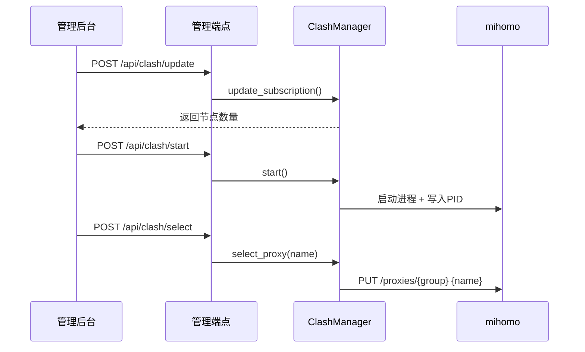

# 架构设计

## 总体架构
```mermaid
flowchart TD
    UI[管理后台 admin.html] -->|HTTP| AdminAPI[/FastAPI 管理端点/]
    Client[OpenAI兼容客户端] -->|HTTP| OpenAIAPI[/FastAPI v1 API/]
    AdminAPI --> Services[业务服务层 app/services]
    OpenAIAPI --> Services
    Services --> Storage[存储层 app/core/storage]
    Services -->|启动/停止/切换| Clash[mihomo(clash) 进程]
    Clash -->|external-controller 9090| ClashAPI[Clash REST API]
    Services --> ClashAPI
```

## 技术栈
- **后端:** Python + FastAPI
- **前端:** 静态 HTML/JS（管理后台）
- **数据:** file/mysql/redis（由配置决定）
- **代理:** mihomo（Clash Meta 兼容）

## 核心流程


## 重大架构决策
当前无新增架构级决策（修复内置 Clash 功能）。

